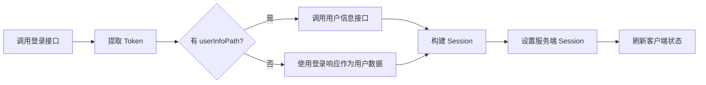

## 概述

`useApiAuth` 扩展了 [nuxt-auth-utils](https://github.com/atinux/nuxt-auth-utils) 的 `useUserSession`，添加了 `login()` 方法来处理完整的登录流程。

::note
使用前请确保已安装并配置 `nuxt-auth-utils` 模块。
::

```vue
<script setup lang="ts">
const { login, clear, loggedIn, user, session, fetch } = useApiAuth()

// 登录
await login({
  loginPath: '/auth/login',
  credentials: { username: 'admin', password: '123456' }
})

// 登出
await clear()

// 响应式状态
watchEffect(() => {
  if (loggedIn.value) {
    console.log('当前用户:', user.value)
    console.log('Session 数据:', session.value)
  }
})
</script>
```

::tip{icon="i-lucide-settings" to="/docs/getting-started/configuration#auth"}
了解认证相关的全局配置选项
::

## 登录流程

`login()` 方法执行以下步骤:



完整示例:

```ts
const { user, token, loginData } = await login({
  loginPath: '/auth/login',
  credentials: { username: 'admin', password: '123456' },
  userInfoPath: '/auth/me',
  tokenExtractor: (res) => res.data?.accessToken,
  sessionBuilder: (user, token, loginData) => ({
    user: { id: user.id, name: user.name },
    loggedInAt: new Date().toISOString(),
    secure: { token, permissions: user.permissions }
  }),
  sessionConfig: { maxAge: 60 * 60 * 24 * 7 },
  endpoint: 'main'
})
```

## Token 提取

默认提取逻辑会依次尝试以下路径:

1. 配置的 `auth.sessionTokenPath`（如果有）
2. `data.token`
3. `data.accessToken`
4. `token`
5. `accessToken`

自定义提取:

```ts
await login({
  loginPath: '/auth/login',
  credentials: { username: 'admin', password: '123456' },
  tokenExtractor: (res) => res.data?.jwt
})
```

## Session 构建

默认构建结构:

```ts
{
  user: User,           // 用户信息
  token: string,        // 访问令牌
  loggedInAt: string    // 登录时间（ISO 格式）
}
```

自定义构建（分离敏感数据）:

```ts
await login({
  loginPath: '/auth/login',
  credentials: { username: 'admin', password: '123456' },
  sessionBuilder: (user, token, loginData) => ({
    user: { id: user.id, name: user.name, avatar: user.avatar },
    secure: { token, refreshToken: loginData.refreshToken },
    loggedInAt: new Date().toISOString()
  })
})
```

::note
`nuxt-auth-utils` 会自动加密 `secure` 字段，保护敏感数据。
::

## Session 配置

通过 `sessionConfig` 自定义 Session 行为:

```ts
await login({
  loginPath: '/auth/login',
  credentials: { username: 'admin', password: '123456' },
  sessionConfig: {
    maxAge: 60 * 60 * 24 * 7, // 7 天
    cookie: {
      httpOnly: true,
      secure: true,
      sameSite: 'lax'
    }
  }
})
```

::warning
生产环境务必设置 `NUXT_SESSION_PASSWORD` 环境变量（建议至少 32 位随机字符串）。
::

::tip{icon="i-lucide-link" to="https://github.com/atinux/nuxt-auth-utils?tab=readme-ov-file#configuration"}
查看完整的 Session 配置选项
::

## 用户信息获取

### 从登录响应获取

```ts
await login({
  loginPath: '/auth/login',
  credentials: { username: 'admin', password: '123456' }
})
```

响应格式示例:

```json
{
  "code": 200,
  "data": {
    "token": "eyJhbGciOiJIUzI1NiIs...",
    "id": 1,
    "name": "Admin"
  }
}
```

### 调用独立接口

```ts
await login({
  loginPath: '/auth/login',
  credentials: { username: 'admin', password: '123456' },
  userInfoPath: '/auth/me'
})
```

会自动使用提取的 token 调用 `/auth/me` 获取用户信息。

## API

### useApiAuth()

```ts
function useApiAuth(): UseApiAuthReturn
```

返回扩展了 `login()` 方法的 `UserSessionComposable`。

#### 返回值

::field-group
  ::field{name="login()" type="<LoginRData = unknown>(options: LoginOptions<LoginRData>) => Promise<LoginResult<LoginRData>>"}
  执行登录流程。
  ::

  ::field{name="loggedIn" type="ComputedRef<boolean>"}
  是否已登录。
  ::

  ::field{name="user" type="ComputedRef<User | null>"}
  当前用户信息。
  ::

  ::field{name="session" type="Ref<UserSession>"}
  当前 Session 数据。
  ::

  ::field{name="fetch()" type="() => Promise<void>"}
  刷新 Session 状态。
  ::

  ::field{name="clear()" type="() => Promise<void>"}
  清除 Session（登出）。
  ::
::

### LoginOptions

```ts
interface LoginOptions<LoginRData = unknown> {
  loginPath: string
  credentials: unknown
  userInfoPath?: string
  tokenExtractor?: (response: ApiResponse<LoginRData>) => string | null | undefined
  sessionBuilder?: (userInfo: User, token: string, loginData: LoginRData) => PartialByKeys<UserSession, 'id'>
  sessionConfig?: Partial<SessionConfig>
  endpoint?: string
}
```

::field-group
  ::field{name="loginPath" type="string" required}
  登录接口路径。
  ::

  ::field{name="credentials" type="unknown" required}
  登录凭证（用户名/密码等）。
  ::

  ::field{name="userInfoPath" type="string"}
  用户信息接口路径。如果提供，登录后会使用 token 调用此接口获取用户信息。
  ::

  ::field{name="tokenExtractor" type="(response: ApiResponse<LoginRData>) => string | null | undefined"}
  自定义 token 提取函数。默认从 `response.token` 或 `response.data.token` 提取。
  ::

  ::field{name="sessionBuilder" type="(userInfo: User, token: string, loginData: LoginRData) => PartialByKeys<UserSession, 'id'>"}
  自定义 Session 构建函数。默认返回 `{ user, token, loggedInAt }`。
  ::

  ::field{name="sessionConfig" type="Partial<SessionConfig>"}
  Session 配置选项（maxAge、cookie 等）。
  - [查看 nuxt-auth-utils 文档](https://github.com/atinux/nuxt-auth-utils?tab=readme-ov-file#configuration)
  ::

  ::field{name="endpoint" type="string"}
  使用指定的端点配置（默认使用 `defaultEndpoint`）。
  ::
::

### LoginResult

```ts
interface LoginResult<LoginRData = unknown> {
  user: User
  token: string
  loginData: LoginRData
}
```

::field-group
  ::field{name="user" type="User"}
  用户信息。
  ::

  ::field{name="token" type="string"}
  认证令牌。
  ::

  ::field{name="loginData" type="LoginRData"}
  登录响应数据（已提取）。
  ::
::

## Changelog

:commit-changelog{prefix="/composables" suffix="ts"}
